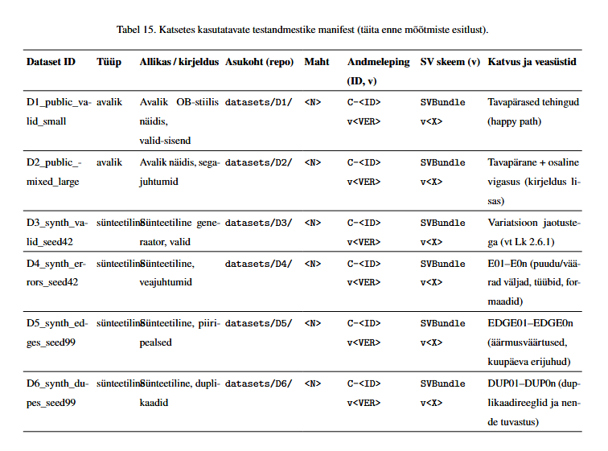

## D1 — public_valid_small (avalik, väike “smoke test”, ideaalis happy path)
### Eesmärk:

Testida adapteri end-to-end töövoogu minimaalsel sisendil: parsimine → SV moodustamine → valideerimine/invariandid → ML/LLM projektsioonid.

Fookus: toru läbitavus ja tulemuste käsitsi kontrollitavus (demo + regressiooni “smoke test”).

### Sisu (praktiliselt, sinu praeguse jooksu põhjal):

1 konto.

N = 4 sisendtehingut, millest SV-sse jõudis 3 ja 1 dropiti (missing valueDate).

Segu staatustest: 2 × BOOKED + 1 × PENDING (SV väljundis).

Võib sisaldada “pehmet” normaliseerimist (nt amount sign vs direction mismatch → invariant WARN).

### Mille poolest erineb teistest:

Kõige väiksem ja käsitsi loetav dataset: sobib illustreerimiseks ja kiireks “kas toru töötab” kontrolliks.

Ei testi mahtu (nagu D2) ega sihitud veasüste (nagu D4); eesmärk pole edge-case’ide või duplikaatide katvus (D5/D6).

### Katvus/veasüstid (manifesti tekst):

Kui tahad, et D1 oleks päriselt “happy path”:
“Väike avalik näidis; E2E smoke test; drop=0; WARN=0 (kureeritud sisend).”

### Oodatav outcome:

Ideaalis SUCCESS (kui D1 on kureeritud “päris happy path”-iks).

Sinu praeguse sisuga realistlikult PARTIAL_SUCCESS (1 drop) ning lisaks võib olla WARN (INV-05 ja/või RUN_DOWNLOAD_ONLY).


## D2 — public_mixed_large (avalik, “pärismaailma segadus”, aga valdavalt läbitav)

### Eesmärk:

Testida adapterit mahu ja “päris-andmete tüüpilise ebaühtluse” peal.

Fookus: läbilaske, sorteerimine/filtreerimine, ML/LLM projektsiooni stabiilsus, mitte niivõrd error-handling.

### Sisu (soovituslik):

1–3 kontot.

N = 500–5000 tehingut.

Segu staatustest: BOOKED + PENDING.

Optional field variance: mõnel puudu bookingDate, mõnel puudu counterparty IBAN, mõnel ainult nimi, mõnel ainult remittance.

Mõned “pehmed” ebatäpsused, mis annavad WARN, aga ei tohi tehingut drop’ida (nt amount sign vs direction normaliseerimine).

### Mille poolest erineb teistest:

Ainus “suur” avalik dataset: stress-test + realistlik varieeruvus.

Ei ole “süstemaatiline veasüst” nagu D4, vaid pigem “elu ise”.

### Katvus/veasüstid (manifesti tekst):

“Mahu test + real-world variatsioon; mõned WARN-id (nt sign/direction normaliseerimine), drop’id = 0.”

### Oodatav outcome: SUCCESS või (kui sul on range poliitika) PARTIAL_SUCCESS, aga eesmärk on 0 drop.


## D3 — synth_valid_seed42 (sünteetiline, puhas valid, baasjoon)

### Eesmärk:

“Kontrollitud labor”: ideaalne happy path sünteetikas.

Kasutada baasandmestikuna, millelt tuletad D4/D5/D6 (mutatsioonid + reeglid).

### Sisu:

1 konto (või 2, kui tahad kontoülest käitumist testida).

N = 1000 (või 10k, kui tahad jõudlust).

Deterministlik mustrid (näited):

Kuutulu (IN) 1x kuus (palga kuupäev ±1).

Üür/laenumakse (OUT) 1x kuus.

Poed/kütus (OUT) nädalas 1–5x.

Harvad suured tehingud (OUT) 0–2x kuus.

Kõik kohustuslikud väljad olemas, formaadid korrektsed.

### Mille poolest erineb:

“Puhtaim” dataset: selle peal ei tohiks sul mitte miski kukkuda ega isegi eriti hoiatada (v.a kui sa tahad testida normaliseerimist).

### Katvus (manifesti tekst):

“Sünteetiline baasjaotus; 0 veasüsti; 0 drop; sobib regressioonitestiks.”

### Oodatav outcome: SUCCESS.


## D4 — synth_errors_seed42 (sünteetiline, sihitud veasüstid)

### Eesmärk:

Kontrollida, et adapter:

valideerib õigel etapil (skeem vs invariandid),

logib üheselt (mis katki, kus),

käitub deterministlikult (sama error → sama tulemus),

ning et PARTIAL_SUCCESS poliitika töötab nii nagu sa oled kirjeldanud.

### Sisu (ehitusloogika):

Võta D3 tehingud ja tee koopia, millele rakendad mutatsioone.

N = 200–500, millest:

60–80% on valid (et toru jõuaks projektsioonideni),

20–40% on vigased (et tekiks drops/errors/warns).

Vead (näidiskoodid, mida saad manifestis kasutada):

E01: valueDate puudu (skeemiviga, drop).

E02: kuupäev vale formaadiga (2017/10/26 vms) (skeem/parse).

E03: amount tüüp vale (string vs number, või “12,34” komaga).

E04: valuuta vale/missing (nt EURO, null).

E05: direction vale väärtus (nt INCOMING).

E06: status vale (nt SETTLED).

E07: counterparty objekti struktuur vale (nt nimi number).

E08: loogikaviga: direction=IN aga signed_amount negatiivne (invariant WARN või ERROR, sõltuvalt su reeglist).

E09: väärtused üle lubatud piiri (nt absurdne pikk remittance) kui sul on piirang.

E10: konto viide vale (transaction.account_id ei eksisteeri accounts listis).

### Mille poolest erineb:

Ainus dataset, kus “katkised asjad” on tahtlikud ja kooditud.

Hea ka “kaitsmisel”: näitad, et sul on sihitud testkatvus, mitte lihtsalt üks demo.

### Katvus (manifesti tekst):

“E01–E10 veasüstid: puudu väljad, tüübid, formaadid, loogikakonfliktid; oodatud drop/warn ja etapidokumentatsioon.”

### Oodatav outcome: PARTIAL_SUCCESS (tavaliselt).


## D5 — synth_edges_seed99 (sünteetiline, piiripealsed, aga valideeritavad)

### Eesmärk:

Testida piirjuhtumeid, mis on formaalselt õiged, aga kipuvad tarkvara murdma (või inimesi).

### Sisu:

N = 200–1000.

Kõik tehingud jäävad skeemi raamidesse (st valueDate olemas jne), aga väärtused on “veidrad”.

EDGE juhtumid (näited):

EDGE01: amount = 0.00 (kas lubad? ML/LLM proj peab olema stabiilne).

EDGE02: väga suur amount (nt 99999999.99).

EDGE03: väga väike amount (nt 0.01), ümarduse test.

EDGE04: bookingDate puudub, valueDate olemas (peaks läbima, kui skeem lubab).

EDGE05: valueDate = 2020-02-29 (liigaasta).

EDGE06: aasta/kuu piiri ületused (12/31, 01/01).

EDGE07: remittance ülipikk (nt 512–2048 tähemärki).

EDGE08: unicode counterparty/remittance (täpid, “ÜÕÄÖ”, emoji) kui sa tahad kindel olla, et JSON/CSV ei kärssa.

EDGE09: sama kuupäevaga palju tehinguid (sorteerimise stabiilsus).

### Mille poolest erineb:

Ei ole “vead”, vaid “kurjad nurgad”.

Mõeldud selleks, et su projektsioonid (CSV/JSON) ei muutuks nondeterministlikuks või ei läheks katki vormingu tõttu.

### Katvus (manifesti tekst):

“EDGE01–EDGE09: null/suurused, kuupäeva erijuhud, pikad tekstid, unicode, sorteerimise stabiilsus; drop=0.”

### Oodatav outcome: SUCCESS (ideaalis).


## D6 — synth_dupes_seed99 (sünteetiline, duplikaadid ja near-dupes)

### Eesmärk:

Testida duplikaatide käsitlust: kas tuvastad, kas jätad alles, kas flag’id, kas dedupeerid (ja kus kihis).

### Sisu:

N = 500–2000.

Duplikaadimäär: 1–10% (sõltuvalt kui karmilt tahad testida).

DUP juhtumid (valitavad):

DUP01 (exact): täpselt sama tehing kordub (sama record_id + sama sisu).

DUP02 (id-clash): sama transaction_id, aga muu sisu (halvim).

DUP03 (record_id-clash): sama record_id, aga muu sisu.

DUP04 (near-dup): sama kuupäev + amount + counterparty + remittance, aga uus id (päriselus sage).

DUP05 (cross-bucket): sama tehing on nii pending kui booked (staatuse üleminek), kontrolli, kas käsitled seda duplikaadina või “state change” juhtumina.

### Mille poolest erineb:

Ei testi skeemi, vaid andmekvaliteeti ja dedupe/flag loogikat.

Väga kasulik, kui sa hiljem mõõdad ML mudeli käitumist: duplikaadid võivad mudelit “õpetada” valesti.

### Katvus (manifesti tekst):

“DUP01–DUP05: exact/near/id-clash/pending→booked; oodatud dupe-flag või dedupe-reegel (kirjeldatud lisas).”

### Oodatav outcome: tavaliselt SUCCESS + WARN-id, kui sa ei dropi; või PARTIAL_SUCCESS, kui id-clash on ERROR sinu invariandi järgi.

## Berlin Group info, mille juhendit võtan aluseks andmete loomiseks

Berlin Group (NextGenPSD2): Berlin Group on Euroopa pankade ja makseasutuste konsortsium, mis töötas välja ühtse avatud panganduse NextGenPSD2 API raamistiku.
See raamistik määratleb kontoandmete ja tehinguinfo (AIS – Account Information Service) vahetamiseks kasutatava andmemudeli ja sõnumite struktuuri.
Berlin Group ei ole ametlik ELi institutsioon, kuid selle standard on laialdaselt kasutusele võetud üle Euroopa – üle 75% Euroopa pankadest ja sajad kolmandad osapooled (TPP-d)
on NextGenPSD2 raamistiku juurutanud.
Berlin Groupi NextGenPSD2 hõlmab üksikasjalikku kontseptuaalset, loogilist ja füüsilist andmemudelit ning tehnilisi sõnumeid, sh JSON formaadis andmevälju konto saldo, tehingute ajaloo jms jaoks


Berlin Group NextGenPSD2 spetsifikatsioonid: Berlin Group on avaldanud terve komplekti dokumente, mis kirjeldavad PSD2 XS2A (Access to Account) liidest.
Põhidokumentide hulgas on NextGenPSD2 Implementation Guidelines – tehniline juhis, mis spetsifitseerib üksikasjalikult konto infosüsteemi API struktuuri,
sh ametlikud XML/JSON skeemid päringute ja vastuste jaoks
Nendes juhistes on täpselt määratletud, millised väljad (nt konto ID, IBAN, valuuta, saldo tüüp, tehingu kuupäev, kirjeldus jms) peab API kaudu edastama
konto väljavõtte või tehinguaruande päringu korral.
Berlin Groupi andmemudel baseerub ISO 20022 standardil, mis tähendab, et andmeväljad ja nende tähendused on kooskõlas pangaülekannete ja kontoinfo rahvusvahelise standardiga.
NextGenPSD2 dokumentatsioon (sh Implementation Guidelines, Operational Rules, jmt) on avalikult kättesaadav Creative Commons litsentsiga – need on tasuta allalaaditavad Berlin Groupi veebilehelt
Seega on Berlin Groupi JSON-skeemid ametlikult dokumenteeritud tööstusstandard, mitte konfidentsiaalne spetsifikatsioon.


Berlin Group openFinance Data Dictionary

PSD2-stiilis transactions JSON-näide:

Sektsioonid: 2.205 ja 2.206
```
{
  "transactionId": "TX123456789",
  "bookingDate": "2025-11-01",
  "valueDate": "2025-11-02",
  "transactionAmount": {
    "amount": "150.00",
    "currency": "EUR"
  },
  "creditorName": "Acme OÜ",
  "remittanceInformationUnstructured": "Rent payment November",
  "bankTransactionCode": "PMNT-IRCT-ESCT",
  "entryReference": "ABC123456",
  "transactionType": "Credit",
  "balanceAfterTransaction": {
    "amount": "1200.00",
    "currency": "EUR"
  }
}
```

```
statementPeriod
{
  "from": "2025-10-01",
  "to": "2025-10-31"
}

account:
{
  "accountId": "EE123456789012345678",
  "currency": "EUR",
  "institution": "DemoBank"
}
```
